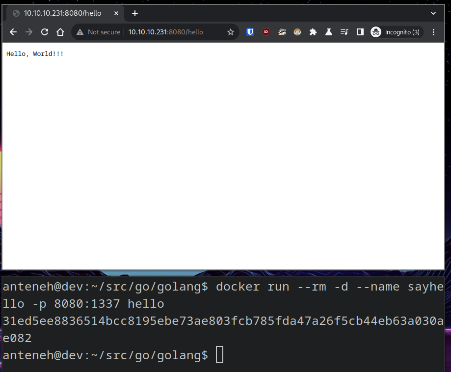

# golang server

## About golang server

Test golang HTTP client and server implementations.

## Built With

+ golang
+ net/http

## Getting Started

To get a local copy up and running follow these steps.

### Prerequisites

+ golang

### Installation

This template doesn't rely on any external dependencies or services.
1. clone the repo
```shell
https://github.com/kidistbedilu/golang.git && cd golang
```
2. install golang
```shell
sudo apt install -y golang
```

### Usage

1. run golang server at port 1337
```shell
go run main.go
```
2. dockerize golang server
   1. build Docker image
   ```shell
   docker build -t hello .
   ```
   2. run container at port 8080
   ```shell
   docker run --rm -d --name sayhello -p 8080:1337 hello
   ```
   3. stop container
   ```shell
   docker stop sayhello
   ```
3. publish Package to GitHub Container Registry / GHCR  
   1. navigate to your image file location
   ```shell
   cd src/golang && ls
   ```
   2. build Docker image
   ```shell
   docker build -t ghcr.io/kidistbedilu/golang:latest .
   ```
   3. test image
   ```shell
   docker run --rm -d --name sayhello -p 8080:1337 ghcr.io/kidistbedilu/golang:latest
   ```
   4. stop container
   ```shell
   docker stop sayhello
   ```
   5. push image to GitHub Container Registry / GHCR
   ```shell
   docker push ghcr.io/kidistbedilu/golang:latest
   ```
   6. login to [GitHub](https://github.com/) then change the package/image from `Private` to `Public` and add `ReadMe` by connecting to a `repository`
4. test [golang package](https://github.com/kidistbedilu/golang/pkgs/container/golang)
   1. pull image
   ```shell
   docker pull ghcr.io/kidistbedilu/golang:latest
   ```
   2. run container at port 8080
   ```shell
   docker run --rm -d --name sayhello -p 8080:1337 ghcr.io/kidistbedilu/golang:latest
   ```
   3. stop container
   ```shell
   docker stop sayhello
   ```

golang server screenshot.


## Roadmap

- [x] golang server
- [x] Dockerize  
    - [x] Publish Docker image to GitHub container registry

> See the [open issues](https://github.com/kidistbedilu/golang/issues) for a full list of proposed features and known issues.

## Contributing

Any contributions you make are greatly appreciated. If you have a suggestion that would make this better, please fork the repo and create a pull request. Don't forget to give the project a star! Thanks again!!!

1. fork the project
2. create your feature branch `git checkout -b feature/amazing-feature`
3. commit your changes `git commit -m 'feat: add amazing feature'` use the [conventional-commit](https://www.conventionalcommits.org/en/v1.0.0/) specification
4. push to the branch `git push origin feature/amazing-feature`
5. open a pull request

## Contact

Kidist Bedilu | [kidistbedilu.com](kidistbedilu.com) | [me@kidistbedilu.com](me@kidistbedilu.com) | [@kidistbedilu](@kidistbedilu)

## License

Distributed under the [MIT License](https://opensource.org/license/mit/).
